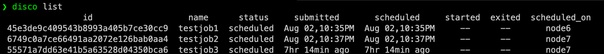
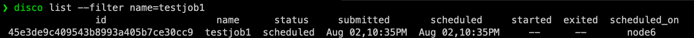
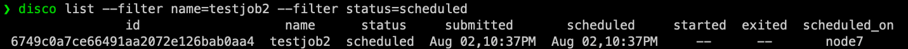
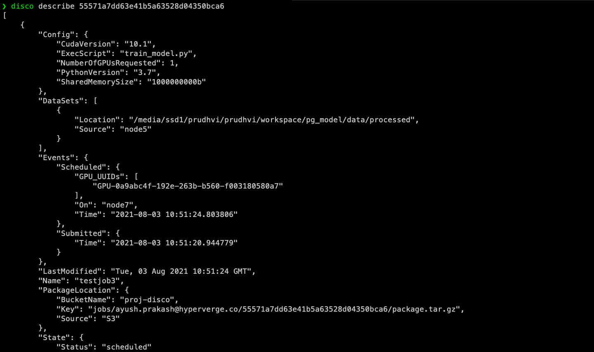

# disco-cli v0.0.1

### To install **disco-cli**, run:

```
pip install git+https://github.com/grayatom/disco-CLI.git
```

---

Disco CLI provide the following commands :

1. whoami
2. list
3. describe
4. status
5. log

---

### 1. The **whoami** command

-This command prints the email id of the user.

```
disco whoami
```


---

### 2. The **list** command

-This command helps user to list all the jobs.

```
disco list
```


-This command offers the functionality to filter jobs as per user's need, using the `--filter` option.

```
disco list --filter name=testjob1
```

_the valid format is **--filter key=value**_



-Users can also apply multiple filters.

```
disco list --filter name=testjob2 --filter status=scheduled
```



-This command also offers users to select the fields (columns) they want to see using the `--attributes` command.

```
disco list --attributes name,status,scheduled_on
```

_the valid format is **--attributes attr1,attr2,attr3,attr4** (comma separated without any space)_


-If the users want to see their jobs in JSON format instead of tabular format they can use the `--json` flag

```
disco list --attributes name,status --filter name=testjob1 --json
```


---

### 3. The **describe** command

-This command help users to get all the details of a job.

-This command takes a **required argument** `job_id`

```
disco describe 55571a7dd63e41b5a63528d04350bca6
```



---

### 4. The **status** command

-This command prints the timeline of a job.

-This command takes a **required argument** `job_id`

```
disco status 55571a7dd63e41b5a63528d04350bca6
```


---

### 5. The **log** command

---
